# Lab - Deploying a JavaEE app to IBM Kubernetes Service with Jenkins

## Overview

In this lab you will  be connecting your Git repository with the Plants by WebSphere app to a Continuous Integration/Continuous Deployment pipeline built with Jenkins that will deploy to a IBM Cloud Kubernetes Service cluster.

## Setup

If you haven't already:

1. Complete the previous section, *Working with Helm*,  by following the instructions [here](https://github.com/odrodrig/app-modernization-helm-lab-iks)

2. Go to the folder where you cloned the Plants By WebSphere  app in the previous lab

   ```shell
   cd app-modernization-plants-by-websphere-jee6
   ```

3. Next, we need to add permissions for our deployment service account. Run the following command:

   ```shell
   kubectl apply -f rbac-config.yaml
   ```

### Step 1: Installing Jenkins

In this section we will install Jenkins onto our Kubernetes cluster on IBM Cloud. First we will create a persistent volume necessary for storing Jenkins data and then we will use Helm to deploy jenkins.

1. In your terminal, from the *app-modernization-plants-by-websphere-jee6* project directory, enter the following command to create a persistent volume storage for your Jenkins data:

   ```shell
   kubectl apply -f volume.yaml
   ```

2. With our volume created, now we can install the Jenkins Helm chart. In your terminal, enter the following command:

   ```shell
   helm install --name jenkins stable/jenkins -f values.yaml --version 1.7.0
   ```

   With that your Jenkins installation should start up in the next few minutes.

   To check to see if your Jenkins is ready, run the following command:

   ```shell
   kubectl get pods
   ```

   You should see a Jenkins pod running as seen below:

   ```text
   NAME                       READY   STATUS    RESTARTS   AGE
   jenkins-67bd95668b-c6tp7   1/1     Running   0          11m
   ```

3. As part of the chart installation, a random password is generated and a Kubernetes secret is created. A Kubernetes secret is an object that contains sensitive data such as a password or a token. Each item in a secret must be base64 encoded. This secret contains a data item named ‘jenkins-admin-password’, which must be decoded.

   The following command gets the value of that data item from the secret named ‘jenkins’ and decodes the result.

   ```shell
   printf $(kubectl get secret --namespace default jenkins -o jsonpath="{.data.jenkins-admin-password}" | base64 --decode);echo
   ```

   A load balancer is then created for Jenkins. When that’s ready, you can log in with the username admin and the password from the previous step. Run the following commands to determine the login URL for Jenkins.

   ```shell
   export SERVICE_IP=$(kubectl get svc --namespace default jenkins --template "{{ range (index .status.loadBalancer.ingress 0) }}{{ . }}{{ end }}")
   ```

   ```shell
   echo http://$SERVICE_IP:8080/login
   ```

   *Note:* If you're using a free IBM Cloud Kubernetes cluster, load balancers are not available but you can use NodePort instead for development purposes. Run the following commands to get your worker's external IP and NodePort of the Jenkins service.

   ```shell
   export NODEPORT=$(kubectl get svc jenkins -o jsonpath='{.spec.ports[].nodePort}')
   ```

   ```shell
   export WORKER_EXTERNAL_IP=$(kubectl get nodes -o jsonpath='{.items[0].status.addresses[?(@.type=="ExternalIP")].address}')
   ```

   ```shell
   echo http://$WORKER_EXTERNAL_IP:$NODEPORT/login
   ```

   Now you should have an instance of Jenkins running in your cluster and you should be able to access the dashboard by following the previous steps.

### Step 2: Configuring Jenkins

In this section we will configure our Jenkins instance in preparation of running our pipeline. This will include creating container templates and adding credentials.

In order for Jenkins to be able to launch pods for running jobs, you have to configure the service account credentials.

1. Navigate to Manage Jenkins > Configure System and then scroll down to the Cloud section and find "credentials", then select “Add" and select "Jenkins".

   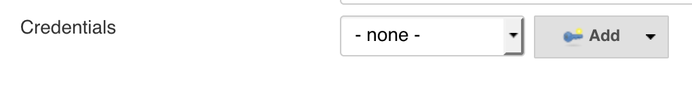

2. In the *Kind* dropdown menu, select *Kubernetes Service Account* and click "Add"

   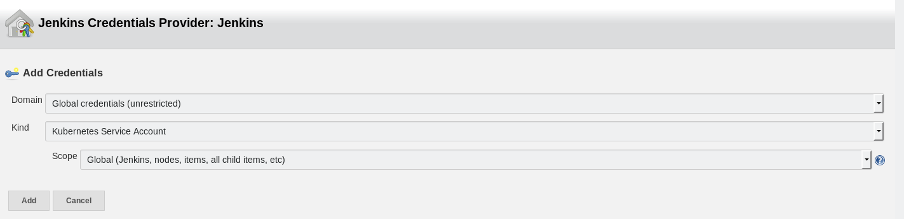

   After adding the credentials, select it by choosing "Secret text" from the dropdown menu of the credentials section.

   

3. Now we need to configure some container templates. These containers will be used to run our stages in the pipeline. The containers that we will be using are the following:

   - JNLP: This container is a Jenkins agent and will run some necessary tasks, such as checkout out code from our repo.
   - Maven: This container will be used to build the application and to run unit tests
   - Docker: This container is used for building the application container image and pushing it to a container registry
   - IBM Cloud developer tools: This container will be used for updating the app in our cluster with the new application container

4. From the "Cloud" section of the settings, scroll down and look for the *Container Template* section and click on the *advanced* button for the *JNLP* container template near the right side of the page. Here we are going to give the agent more resources so that it does not crash while running the pipeline.

5. Edit the resource limits with the following values:

   |Field           |Value |
   |----------------|------|
   |Request CPU     |500m  |
   |Request Memory  |512Mi |
   |Limit CPU       |500m  |
   |Limit Memory    |512Mi |

   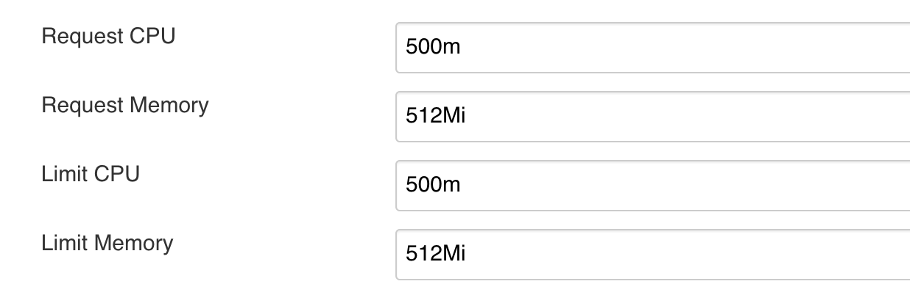

6. Then, click on the *Add container* button under the JNLP container and select *container template*

   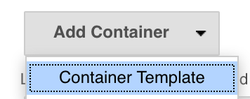

7. Fill in the details for the Maven container as seen in the image below.

   ```text
   Name: maven
   Docker image: maven:latest
   Command to run: cat
   Arguments to pass:
   ```

   

8. Add a new container template again and fill in the details for the Docker container template as seen below. Be sure to click on "Advanced" and select "Run in privilaged mode".

   ```text
   Name: build
   Docker image: docker:stable-dind
   Command to run:
   Arguments to pass:
   ```

   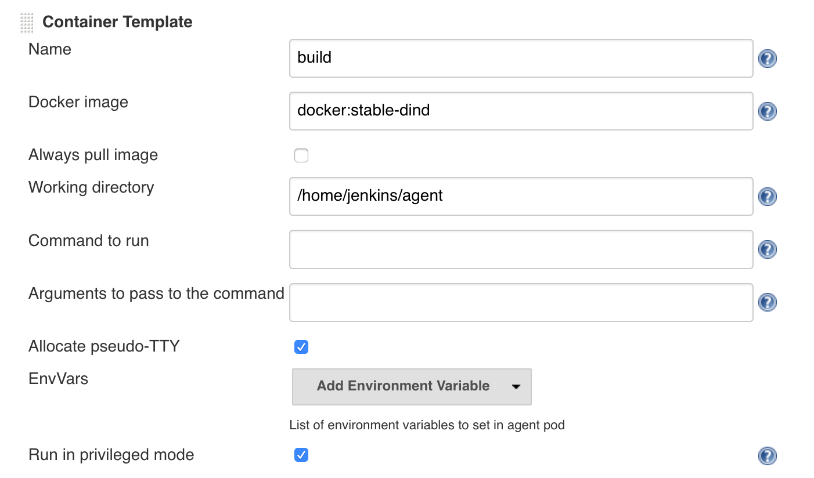

9. Add one more container template and fill in the details for the IBM Cloud container template as seen below.

   ```text
   Name: ibmcloud
   Docker Image: ibmcom/ibm-cloud-developer-tools-amd64:latest
   Command to run: cat
   Arguments to pass:
   ```

   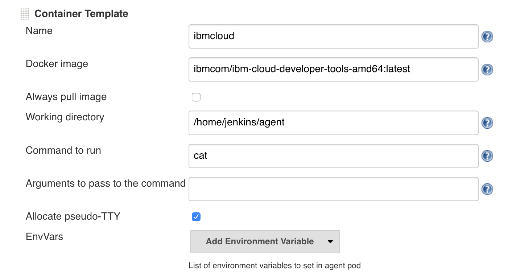

10. Click **Save** at the bottom of the page

11. Now lastly, we need to add an IBM Cloud API Key to your Jenkins credentials so that we can deploy to your kubernetes cluster. Click on **credentials** on the navigation menu on the left side of the page and then click on **system** right under it.

12. Near the center of the page, click on *Global credentials (unrestricted)*

   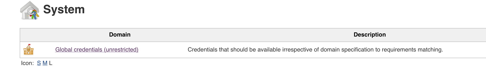

13. Then, click on *Add credential* on the left side of the page.

14. Enter the following information for the credential:

   |Field    |Value                  |
   |---------|-----------------------|
   |kind     |Username with password |
   |Username |iamapikey              |
   |Password |(API Key given to you) |
   |ID       |cluster-creds          |

   Your credential should look like the following image:

   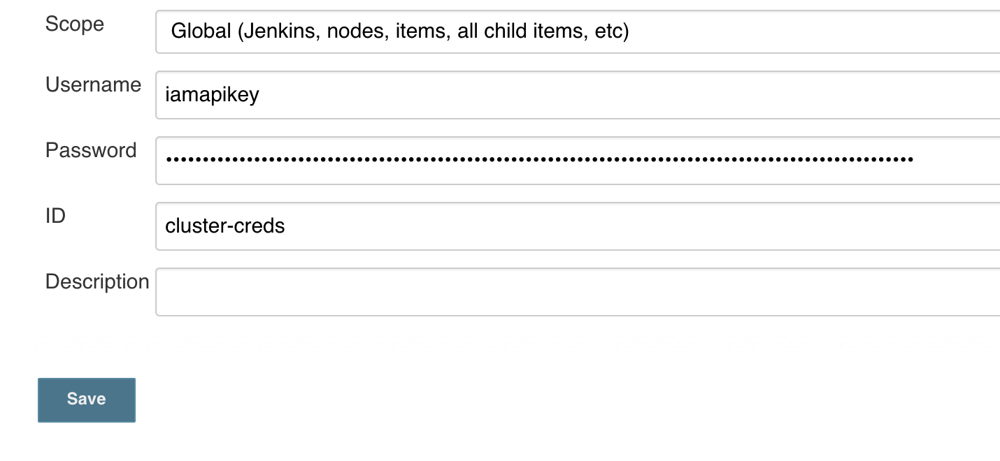

15. Click **save**

### Step 1: Set up the CI/CD pipeline

In this section we will be connecting our cloned Git repo of [this app](https://github.com/odrodrig/app-modernization-plants-by-websphere-jee6)  to set up a Continuous Integration/Continuous Deployment pipeline built with Jenkins. This pipeline contains 4main  steps as follows:

  | Stage                         | Purpose                                                                        |
  | ----------------------------- | ------------------------------------------------------------------------------ |
  | Initialize                    | Checks to see if the required variables exist in the environment               |
  | Build application binary      | Pulls in dependencies from Maven and packages application into .ear file       |
  | Build and Push Docker Image to Registry | Builds and then uploads the Docker image to the Docker image registry in IBM Cloud |
  | Deploy New Docker Image       | Updates the image tag in the Kubernetes deployment triggering a rolling update |

More details of this pipeline can be found in the [Jenkinsfile](https://raw.githubusercontent.com/odrodrig/app-modernization-plants-by-websphere-jee6/master/Jenkinsfile.iks).

1. Click on "Jenkins" at the top left of the page to go back to the homepage.

2. Then, click on **New Item** on the left side.

   

3. On the new page, give your pipeline a name (doesn't matter what) and select **pipeline** and click *ok*.

   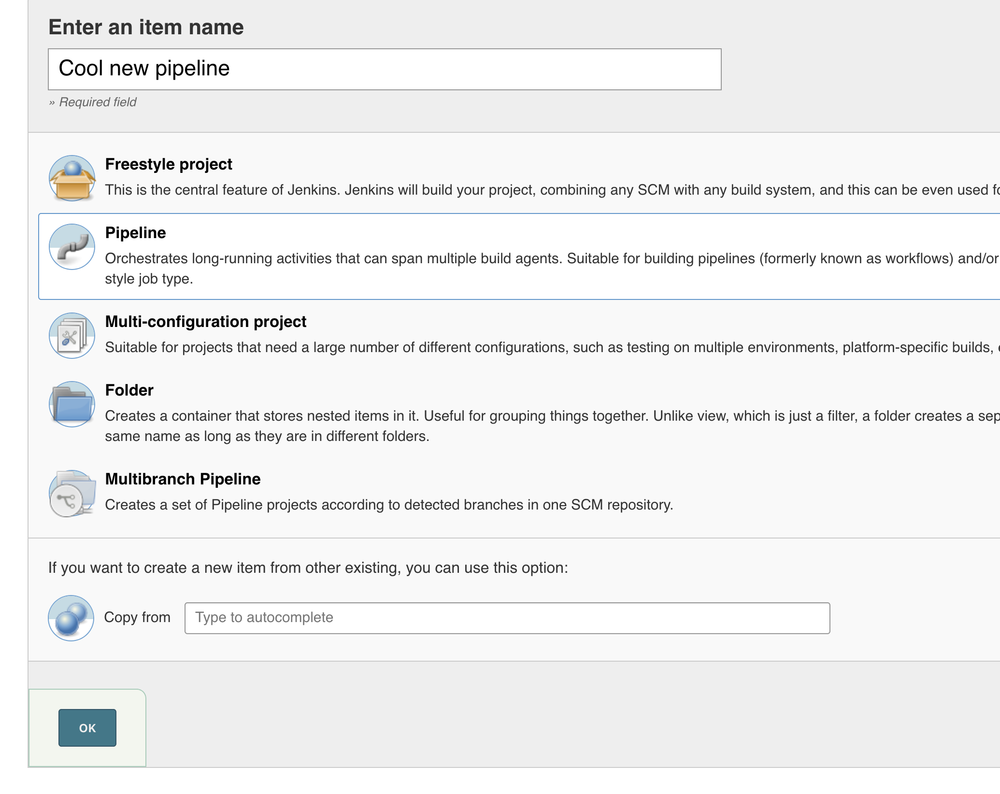

4. This new page is the pipeline configuration page. Scroll down to the **Pipeline** section and find the **Definition** drop down menu. Select **Pipeline script from SCM** and for **SCM** select **Git**. This option means that we will be pointing to a git repository where our Jenkinsfile is.

5. For **Repository URL** enter the url to the cloned repository that you forked earlier (i.e. `https://github.com/[your username]/app-modernization-plants-by-websphere-jee6.git`)

6. Change the **Script Path** to `Jenkinsfile.iks`

   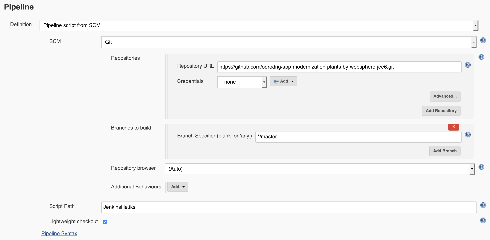

7. Scroll up to the **Build Trigger** section and select **GitHub hook trigger for GIT SCM polling**

   

8. Before we kick off our pipeline, there are a few environment variables that we need to set. Scroll up and select the option that says *This project is parameterized*. Then click on the *Add Parameter* drop down that appears and select **string parameter**

   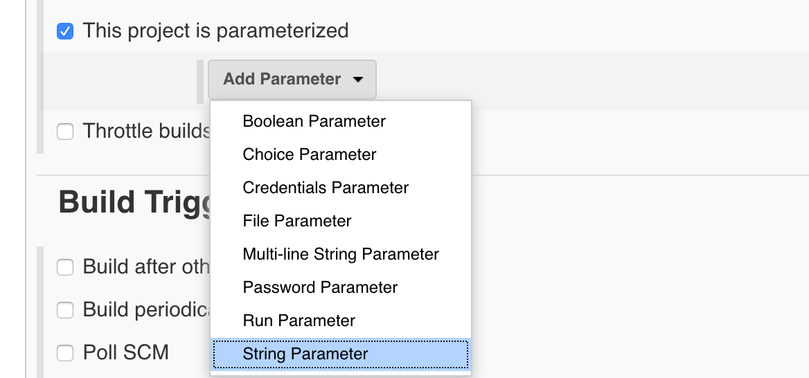

9. In the new parameter that comes up, enter the following information:

   ```text
   Name: CLUSTER_NAME
   Default Value: (The name of the cluster given to you)
   ```

   Then, add another string parameter and enter the following information

   ```text
   Name: REGISTRY_NS
   Default Value: (The registry namespace given to you)
   ```

   Add another string parameter and enter the following

   ```text
   Name: USER
   Default value: (The user given to you)
   ```

   And finally, add one last string parameter and enter the following information

   ```text
   Name: REGION
   Default Value: (The region given to you)
   ```

   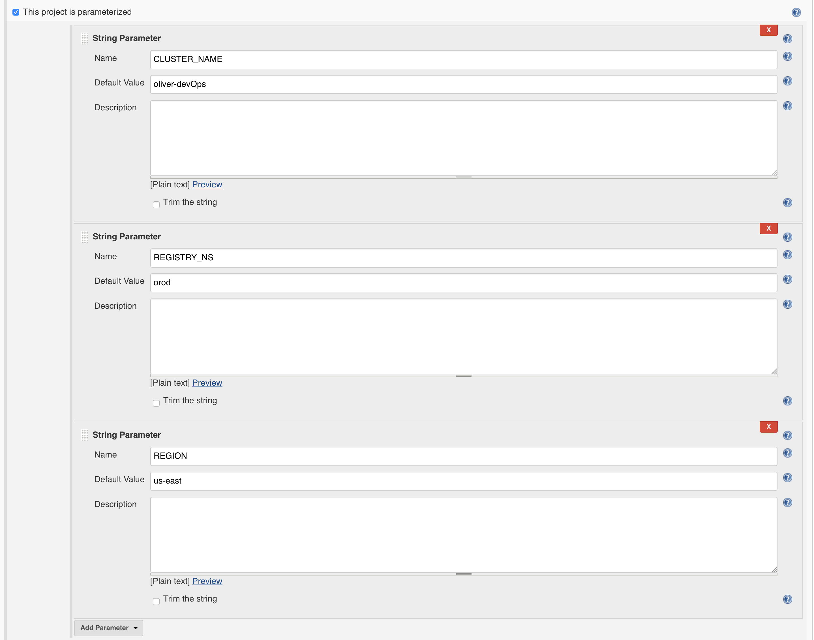

10. Click **Save**.

### Step 3: Manually trigger a build to test pipeline

1. In Jenkins in the navigation area on the left, click on **Build with Parameters**. Accept the defaults of the parameters and click on **Build**

2. To see the console output click on the build number in the **Build History** and then click on **Console Output**

   

3. If the build is successful the end of the console output should look like the following:

   

   The Stage View of the pipeline should look like the following:

   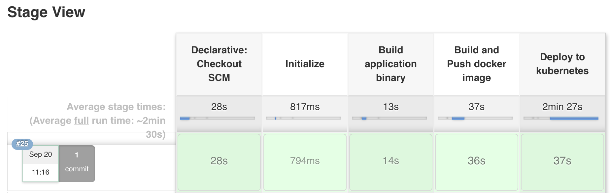

### Step 4: Trigger a build via a commit to Github

Now you'll configure Github to trigger your pipeline whenever code is committed.

1. Go back to Github and find your cloned repository

2. Click on the repository settings

   

3. Under **Options** select **Webhooks** and click **Add webhook**

   

4. For the Payload URL use `<Jenkins URL>/github-webhook/`  where `<Jenkins URL>` is the  URL you used  to login to Jenkins (**Note** Don't forget the trailing `/`)

5. Change content type to **application/json**

6. Accept the other defaults and click **Add webhook**

   

7. In the Github file browser drill down to *pbw-web/src/main/webapp/promo.xhtml*

8. Click on the pencil icon to edit **promo.xhtml**  and on line 95 locate the price of the Bonsai Tree

9. Change  `$30.00 each` to `<strike>$30.00</strike> $25.00 each`

   This will show the price of the Bonsai Tree as being reduced even more

   

10. At the bottom of the UI window add a commit message and click on **Commit changes**

11. Switch back to Jenkins  and open the pipeline that you were working on  earlier.

12. Verify that your pipeline  starts building.

13. When the pipeline is finished deploying, launch the app to verify the change you made.

14. Run the following command to get the port number of your deployed app

   ```shell
   kubectl --namespace default get service pbw-liberty-mariadb-liberty -o jsonpath='{.spec.ports[0].nodePort}'
   ```

15. Run the following command to get the external IP address  of the first worker node in your cluster

   >If you don't have the $USERNAME environment variable in the command set, replace $USERNAME with your lab user id.

   ```shell
   ibmcloud cs workers $CLUSTER_NAME | grep -v '^*' | egrep -v "(ID|OK)" | awk '{print $2;}' | head -n1
   ```

16. Your app's URL is the IP address of the first worker node with the port number of the deployed app. For example if your external IP is 169.61.73.182 and the port is 30961 the URL will be ```http://169.61.73.182:30961```

17. Enter the URL in hr browser's address bar and verify that the price of the Bonsai tree has been reduced.

   

## Summary

You created a Jenkins pipeline to automatically build and deploy an app that has been updated in Github .
